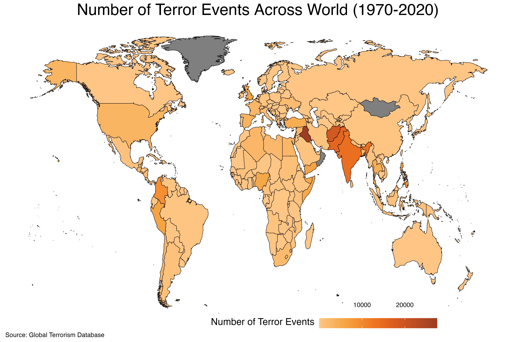

```{r setup, include=FALSE}
## Global options
knitr::opts_chunk$set(cache = TRUE)
```

Hosted by the National Consortium for the Study of Terrorism and Responses to Terrorism (START), the Global Terrorism Dataset offers a wide-range of data on terror events occured across worldwide since 1970. [In its website](https://www.start.umd.edu/gtd/), it is written that;

> The Global Terrorism Database (GTD) is an open-source database including information on terrorist events around the world from 1970 through 2020 (with annual updates planned for the future). Unlike many other event databases, the GTD includes systematic data on domestic as well as international terrorist incidents that have occurred during this time period and now includes more than 200,000 cases.


In this blog post, I will first demonstrate how to download the data, analyze it and finally produce a map visualising the terror events occurred in different parts of the world using the `tidyverse` package in R. 

# Introductory Steps

As a first step, the data can be downloaded from the [GTD's official website](https://www.start.umd.edu/gtd/contact/download) by filling out a form. As I do have the data from 2020 already downloaded on my computer, I will not update it. However, if you will be getting the data for the first time, most probably, you will have a more recent version which will offer a more comprehensive point of view. Yet, the steps to clean, analyze and visualize the data will be the same. So, let's start by first reading the data into our workspace and getting the relevant libraries. 

# Installing Libraries and the data into R

```{r, warning=FALSE, message=FALSE, echo=TRUE, class.source="codeBackground"}
options(scipen=999) # to prevent scientific notation 
library(readxl) # to read excel files
library(tidyverse) # for data analysis purposes and visulization -> tidyverse mainly contains ggplot2 and dplyr
library(maps) # getting geospatial data for countries
library(countrycode) # this package will help us when we try to minimize the differences with regards to country names across different datasets 
library(ggtext) # to make the final map better looking
```

Now, let's read the GTD data and the geospatial data determining the boundaries of countries across world into R.

# {.panelset}

## Code

```{r, warning=FALSE, message=FALSE, echo=TRUE, results = FALSE, class.source="codeBackground"}
# Be careful about where your R working directory is and where your downloaded data is located. If your data is not in the same place where your R working directory is, then R cannot read the data.

gtd_data <- read_excel("/Users/muhammetozkaraca/Desktop/globalterrorismdb_0522dist.xlsx") # getting the GTD data
world <- map_data("world") # getting the geospatial data for countries

head(gtd_data)
```

## Output

```{r, echo=FALSE, eval=TRUE, class.output="codeBackground"}

head(gtd_data)

```

# 


As can be seen from the output, the GTD data frame has 209.706 rows, each row corresponding to a different terror event since 1970 and 135 columns as features for these terror incidents. Now, before delving into data analysis part, it should be noted that terrorism, as a concept, has no standard definition, as one old saying put it well *"One man's terrorist might become another's freedom fighter."* To handle this challenge in terms of defining which attacks can be called as terror incidents, the GTD declares that a terror event must have **the three following criteria**;

- The incident must be intentional
- The incident must entail some level of violence or immediate threat of violence
- The perpetrators of the incidents must be sub-national actors

Additionally, based on its codebook, **at least two of the following three criteria** must be present for an attack to be called as a *terror incident*. 

- Criterion 1: The act must be aimed at attaining a political, economic, religious, or social goal.
- Criterion 2: There must be evidence of an intention to coerce, intimidate, or convey some other message to a larger audience (or audiences) than the immediate victims.
- Criterion 3: The action must be outside the context of legitimate warfare activities.

While these criteria are coded in the dataset as *crit1*, *crit2*, and *crit3*, one can subset the whole data based on these criteria as s/he wishes. However, for the sake of this analysis, we will not subset the data. Instead, what we will do right now is to aggregate the data based on countries to see number of terror events per country since 1970, and then merge it with the geosptial data determining the boundaries of countries. In the final step, using this information, we will produce the map output. So, let's start with aggregating the data according to country-level. 

# {.panelset}
## Code
```{r, warning=FALSE, message=FALSE, echo=TRUE, results = FALSE, class.source="codeBackground"}

country_level_terror_events <- gtd_data %>%
  group_by(country_txt) %>%
  mutate(terror_events_number = n()) %>%
  select(country_txt, terror_events_number) %>%
  unique()

head(country_level_terror_events)

```

## Output

```{r, warning=FALSE, message=FALSE, echo=FALSE, class.output="codeBackground"}
head(country_level_terror_events)
```

#

Now, based on the GTD data, we can see that terror events has occurred in 204 different countries since 1970. If we use the `arrange()` function from the `dplyr` package containing within the `tidyverse` to sort the number of terror events per countries since 1970 in a descending order, we can see that the top five countries exposed to the terror events, along with their corresponding terror incident numbers are; **Iraq** - *27521*, **Afghanistan** - *18920*, **Pakistan** - *15504*, **India** - *13929*, **Colombia** - *8915*. 


# {.panelset}
## Code
```{r, warning=FALSE, message=FALSE, echo=TRUE, results = FALSE, class.source="codeBackground"}
country_level_terror_events %>%
  arrange(desc(terror_events_number)) 
```

## Output

```{r, warning=FALSE, message=FALSE, echo=FALSE, class.output="codeBackground"}
country_level_terror_events %>%
  arrange(desc(terror_events_number)) 
```

#

After this quick glance at the data, now our tasks is to merge the `country_level_terror_events` with `world` data containing the geospatial information for countries' borders to produce the final map. 

# Merging the datasets

Before using the powerful `left_join()` function to merge the two different datasets, let's see whether there are differences regarding the country names. However, please note that we need to minimize the differences in country names occurring due to either punctuation, abbreviation or some other reasons to have a reliable output. So, in this step, we will take assistance from another power library in R, named `countrycode` package. 

`countrycode` package helps to convert country names to different standard formats, either numerical or letter-based abbreviations, to minimize the differences in country names occurring for several reasons. So, what we will do now is to convert country names from the two datasets into 3-letter abbreviations and then figure out which countries are different between the two datasets. 

# {.panelset}
## Code
```{r, warning=FALSE, message=FALSE, echo=TRUE, results = FALSE, class.source="codeBackground"}
country_level_terror_events$iso3c <- countrycode(country_level_terror_events$country_txt, origin = 'country.name',
                                                 destination = 'iso3c') 
world$iso3c <- countrycode(world$region, origin = 'country.name', destination = 'iso3c') 

different_country_names <- setdiff(country_level_terror_events$iso3c, world$iso3c)
countrycode(different_country_names, origin = 'iso3c', destination = 'country.name') 

```

## Output

```{r, warning=FALSE, message=FALSE, echo=FALSE, class.output="codeBackground"}
countrycode(different_country_names, origin = 'iso3c', destination = 'country.name') 
```

#

As can be seen from the output, there are only 2 countries having different names across the two datasets we are working on. And this difference happens to appear since the ambiguity with regards to the status of Hong Kong.^[Please note that, because the GTD data contains terror events since 1970, countries that no longer exists such as Yugoslavia or East Germany, have corresponding number of terror events. We do exclude these in our analysis since they are either splitted into different countries as in the case of Yugoslavia or they formed new ones such as the unification of East and West Germany.]

Now, what we will do is to merge these two datasets based on the 3-letter abbreviations to produce the final map. 

# {.panelset}
## Code
```{r, warning=FALSE, message=FALSE, echo=TRUE, results = FALSE, class.source="codeBackground"}

final_data <- world %>%
  left_join(country_level_terror_events, by = c("iso3c"))

head(final_data)
```

## Output

```{r, warning=FALSE, message=FALSE, echo=FALSE, class.output="codeBackground"}
head(final_data)
```

#

Now, let's look at the map we produced.

# {.panelset}
## Code
```{r, warning=FALSE, message=FALSE, echo=TRUE, results = FALSE, class.source="codeBackground"}
plot <- final_data %>%
  filter(region != c("Antarctica")) %>% # we exclude Antarctica and as it does not have any corresponding number of terror events and not many people live there. 
  ggplot(aes(x = long, y = lat, group = group, fill = terror_events_number)) +
  geom_polygon()

```

## Output

```{r, warning=FALSE, message=FALSE, echo=FALSE, class.output="codeBackground"}
plot
```

# Final Steps

Now, let's make the map a little bit beautiful. 


# {.panelset}
## Code
```{r, warning=FALSE, message=FALSE, echo=TRUE, results = FALSE, class.source="codeBackground"}
plot <- final_data %>%
  filter(region != c("Antarctica")) %>% # we exclude Antarctica and as it does not have any corresponding number of terror events and not many people live there. 
  ggplot(aes(x = long, y = lat, group = group, fill = terror_events_number)) +
  geom_polygon(color = "black", lwd = 0.2) +
  labs(title = "Number of Terror Events Across World (1970-2020)",
       caption = "Source: Global Terrorism Database") +
  ggthemes::theme_map() +
  paletteer::scale_fill_paletteer_c("ggthemes::Orange",
                                    name = "Number of Terror Events") +
  guides(size = guide_legend(title.position="top", title.hjust = 0.5)) +
  theme(plot.title = element_markdown(size = 20, hjust = 0.5, lineheight = 0),
        plot.caption = element_markdown(size = 8, hjust = 0, lineheight = 0),
        plot.background = element_rect(fill = "white", color = "white"),
        panel.border = element_blank(), 
        axis.title.x = element_blank(), 
        axis.title.y = element_blank(), 
        axis.text.x = element_blank(),
        axis.text.y = element_blank(),
        axis.ticks = element_blank(),
        legend.position = c(0.4, -0.05),
        legend.title = element_text(size = 12, lineheight = 0.1, hjust = 0.5, vjust = 1), 
        legend.text = element_text(size = 8, lineheight = 0.2, hjust = 0.5, vjust = 23), 
        legend.direction = "horizontal", 
        legend.key.height= unit(0.45, "cm"),
        legend.key.width= unit(1.05, "cm")) 
    
```

## Output

```{r, warning=FALSE, message=FALSE, echo=FALSE, class.output="codeBackground"}

```


