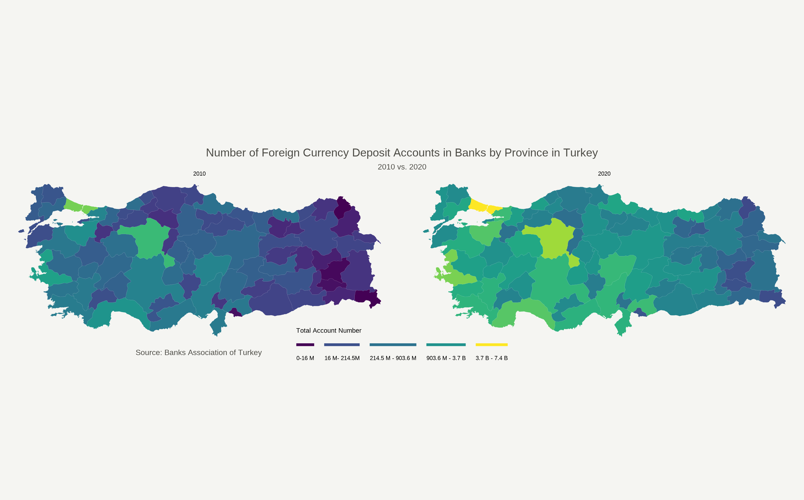

```{r setup, include=FALSE}
## Global options
knitr::opts_chunk$set(cache = TRUE)
```


In recent years, the Turkish lira has depreciated significantly against foreign currencies. To hedge against this depreciation along with the increasing inflation, several Turkish people have converted their funds to other currencies, mainly the US dollar and the Euro. This process leads them to open bank accounts in foreign currencies. In this post, I will attempt to visualize this process by mapping the number of foreign currency accounts by Turkish cities. My analysis will entail a comparison of 2010 and 2020. To this end, I will utilize "Number of Foreign Currency Deposit Accounts" data from the [Banks Association of Turkey](https://verisistemi.tbb.org.tr/index.php?/tbb/report_bolgeler)^[In Turkish, Türkiye Bankalar Biriliği]. The geospatial data I will use in this post will come from the [GADM](https://gadm.org/download_country.html). As written in its website, please note that the GADM data cannot be used for commercial purposes. 

In the first stage, I will download data from both sources. After tidying the `Number of Foreign Currency Deposit Accounts` data, I will merge it with the geospatial data. Finally, I will try to make the map to demonstrate the change in foreign currency deposit accounts by Turkish cities. 

# Introductory Steps

As a first step, I will download data from [the Banks Association of Turkey](https://verisistemi.tbb.org.tr/index.php?/tbb/report_bolgeler). When you click on the previous highlighted link, you will see that there are 3 main columns, namely:
`Geographical Regions and Provinces`, `Periods`, `Parameters`. Please choose `Select All` in the `Geographical Regions and Provinces` part by excluding all rows until Istanbul. In the `Periods`, we can select only 2010 and 2020 since we will only use these. Finally, in the `Parameters` part, I kindly ask you to select `Number of Foreign Currency Deposit Accounts` since this is the data we will use in this post. After that, you can click on `Report` and, by clicking on the Excel icon on the new page, you can download the data onto your computer automatically. 


In a similar manner, let's move on [the GADM website](https://gadm.org/download_country.html) and please select `Turkey` from the country list, as well as click on `Shapefile` and download the data. 

Now, let's load the required packages and the data into our working space and start exploring the data. 

# Installing Libraries and the data into R

```{r, warning=FALSE, message=FALSE, echo=TRUE, class.source="codeBackground"}
options(scipen=999) # to prevent scientific notation 
library(readxl) # to read excel files
library(tidyverse) # for data analysis purposes and visulization -> tidyverse mainly contains ggplot2 and dplyr
library(viridis) # to make visualisations
library(sf)      # to read geospatial data
```

Now, let's install data in R and look at the head of `Number of Foreign Currency Deposit Accounts` data. 

# {.panelset}

## Code

```{r, warning=FALSE, message=FALSE, echo=TRUE, results = FALSE, class.source="codeBackground"}
# Be careful about where your R working directory is and where your downloaded data is located. If your data is not in the same place where your R working directory is, then R cannot read the data.

foreign_currency_accounts <- read_excel("~/Desktop/PivotGrid-3.xlsx")
tur_spatial <- read_sf("~/Desktop/gadm41_TUR_shp/gadm41_TUR_1.shp")
head(foreign_currency_accounts)
```

## Output

```{r, echo=FALSE, eval=TRUE, class.output="codeBackground"}
head(foreign_currency_accounts)
```

# 

As can be seen from the output, the data frame format for the `Number of Foreign Currency Deposit Accounts` is not convenient to conduct further analysis. So, we will need a brief data cleaning effort here. Please also note that we specifically choose the `gadm41_TUR_1.shp` file to read into the working space as it contains geospatial data on the boundaries of the Turkish cities.


# {.panelset}
## Code
```{r, warning=FALSE, message=FALSE, echo=TRUE, results = FALSE, class.source="codeBackground"}
colnames(foreign_currency_accounts) <- c("", "cities", "2010", 2020)

foreign_currency_accounts <- foreign_currency_accounts %>%
  select("cities", "2010", "2020") %>%
  pivot_longer(!"cities", names_to = "years", values_to = "account_numbers")

head(foreign_currency_accounts)
```

## Output

```{r, warning=FALSE, message=FALSE, echo=FALSE, class.output="codeBackground"}

head(foreign_currency_accounts)

```

#
Let us revise what we have done so far. We first renamed the column names in our data set to as it would not lead to further misunderstandings. Then, by using `select` function from the `dplyr` package, we selected 3 crucial columns for our analysis from the main dataset. They are, namely, `cities`, `2010`, and `2020`. Following that, as we wanted the years to be stored in a new column named `years`, and the values corresponding to them in a new column named `account_numbers`, we used the powerful `pivot_longer` function from the `dplyr` package. 

`!"cities"` told R not to touch this column. `names_to` told R to store `2010`, and `2020` in a new column named `years` and the corresponding values went to the new `account_numbers` column by using `values_to` argument. Before moving on, if you want to have a further look at `pivot_longer()` function, you can try [this website](https://tidyr.tidyverse.org/reference/pivot_longer.html). 

Now, let's focus on the `tur_spatial` data and view the data. 

# {.panelset}

## Code

```{r, warning=FALSE, message=FALSE, echo=TRUE, results = FALSE, class.source="codeBackground"}
head(tur_spatial)
```

## Output

```{r, warning=FALSE, message=FALSE, echo=FALSE, class.output="codeBackground"}
head(tur_spatial)
```

#

Now, as a second step, we need to merge `Number of Foreign Currency Deposit Accounts` data with `tur_spatial` data so that we can have corresponding values stored for the relevant cities to make the map we are aiming for. 

# Merging Datasets

This step has another tricky part as it requires a careful examination with regards to Turkish cities' names due to the punctuation differences between the two datasets we are working on. While this problem occurs because of the nature of the Turkish language, with a careful examination, we can handle this problem. 

# {.panelset}

## Code

```{r, warning=FALSE, message=FALSE, echo=TRUE, results = FALSE, class.source="codeBackground"}

tur_spatial <- tur_spatial %>%
  mutate(NAME_1 = case_when(NAME_1 == "Adiyaman" ~ "Adıyaman",
                            NAME_1 == "Afyon" ~ "Afyonkarahisar",
                            NAME_1 == "Agri" ~ "Ağrı",
                            NAME_1 == "Aydin" ~ "Aydın",
                            NAME_1 == "Balikesir" ~ "Balıkesir",
                            NAME_1 == "Çankiri" ~ "Çankırı",
                            NAME_1 == "Diyarbakir" ~ "Diyarbakır",
                            NAME_1 == "Eskisehir" ~ "Eskişehir",
                            NAME_1 == "Gümüshane" ~ "Gümüşhane",
                            NAME_1 == "Istanbul" ~ "İstanbul",
                            NAME_1 == "Izmir" ~ "İzmir",
                            NAME_1 == "K. Maras" ~ "Kahramanmaraş",
                            NAME_1 == "Kinkkale" ~ "Kırıkkale",
                            NAME_1 == "Kirklareli" ~ "Kırklareli",
                            NAME_1 == "Kirsehir" ~ "Kırşehir",
                            NAME_1 == "Mersin" ~ "İçel",
                            NAME_1 == "Mugla" ~ "Muğla",
                            NAME_1 == "Mus" ~ "Muş",
                            NAME_1 == "Nigde" ~ "Niğde",
                            NAME_1 == "Sanliurfa" ~ "Şanlıurfa",
                            NAME_1 == "Sirnak" ~ "Şırnak",
                            NAME_1 == "Tekirdag" ~ "Tekirdağ",
                            NAME_1 == "Usak" ~ "Uşak",
                            NAME_1 == "Zinguldak" ~ "Zonguldak",
                            TRUE ~ NAME_1))

colnames(tur_spatial)[4] <- "cities"

final_data <- tur_spatial %>%
  left_join(foreign_currency_accounts, by = c("cities"))

quantile(final_data$account_numbers, probs = seq(0, 1, 0.25), na.rm = FALSE)
```

## Output


```{r, warning=FALSE, message=FALSE, echo=FALSE, class.output = "codeOutput"}
quantile(final_data$account_numbers, probs = seq(0, 1, 0.25), na.rm = FALSE)
```


# 

The above code solved the punctuation differences between the two datasets we are working on and merged these two datasets accordingly. To elaborate on what we have done so far, we first eliminated the punctuation differences between the two datasets using `case_when()` function and then merged them into the `final_data` we will be using to make the map.^[Although I tried to explain the steps as simple as possible, if these explanations might not be convenient for you, I would recommend you look at [this website to understand how to use `left_join` function](https://statisticsglobe.com/r-dplyr-join-inner-left-right-full-semi-anti)]. 

Also, note that with the `quantile()` function, we got an idea on distribution of the `account_numbers()`, which will help us to set the boundaries for the legend when we will be making the map later. 


# Visualize the Data

Now, as the last step, we will visualize our data with the following code chunk; 

```{r, warning=FALSE, message=FALSE, echo=TRUE, results = FALSE, class.source="codeBackground"}

plot <- final_data %>%
  select(years, cities, account_numbers, geometry) %>%
  # filter(years == 2010) %>%
  ggplot() +#
  geom_sf(aes(fill = account_numbers), color = "white", lwd = 0.01) +
  facet_wrap(~years, nrow = 1) +
  theme_void() +
  labs(title = "Number of Foreign Currency Deposit Accounts in Banks by Province in Turkey",
       subtitle = "2010 vs. 2020",
       caption = "Source: Banks Association of Turkey") +
  scale_fill_viridis(name="Total Account Number", trans = "log",
                     breaks = c(16087000, 214470250, 903586500, 3665321750, 735192229941), 
                     labels = c("0-16 M", "16 M- 214.5M", "214.5 M - 903.6 M", "903.6 M - 3.7 B", "3.7 B - 7.4 B"),
                     guide = guide_legend(keyheight = unit(1, units = "mm"), 
                                          keywidth=unit(6, units = "mm"), 
                                          label.position = "bottom", title.position = 'top',
                                          nrow=1)) +
  theme(plot.background = element_rect(fill = "#f5f5f2", color = NA),
        panel.background = element_rect(fill = "#f5f5f2", color = NA),
        legend.background = element_rect(fill = "#f5f5f2", color = NA),
        legend.text = element_text(size = 18),
        legend.title = element_text(size = 20),
        strip.text = element_text(size = 18),
        plot.title = element_text(size= 35, hjust = 0.5, color = "#4e4d47"),
        plot.subtitle = element_text(size= 24, hjust = 0.5, color = "#4e4d47"),
        plot.caption = element_text(size=24, color = "#4e4d47", hjust = 0.2),
        legend.position = c(0.5, 0),
        legend.direction = "horizontal") 


```


```{r, warning=FALSE, message=FALSE, echo=FALSE, results = TRUE, class.source="codeBackground"}

```

Voilà, here is our beautiful map that demonstrates a comparison of the number of foreign currency deposit accounts in Turkey between 2010 and 2020 by city-level. Before concluding our post, let us look at some specific arguments we made while making this plot. 

- We want each city to be colored based on the corresponding number of foreign deposit accounts, so we write this `fill = account_numbers`. If you would like to adjust the transparency of the colors for each city, you can customize `alpha` argument inside `geom_sf()` function. 0 corresponds to full transparency, while 1 corresponds to full opacity.
- `theme_void` argument provides a blank background. By using `scale_fill_viridis`, we color our map. As the distribution of `account_numbers` data is not normal^[we can find out this with a box plot using `boxplot(final_data$account_numbers)` code], we can use `trans = "log"` argument to see the change between 2010 and 2020 better.
- Without going into further details, I want to lastly point out that `facet_wrap()` function, which helps to see the comparison between the 2010 and the 2020. If you want to look further into the specifics of these arguments, [this website](https://www.r-graph-gallery.com) has wonderful tutorials for making visualisations in R that I am sure will satisfy your needs. 

To conclude, in this tutorial, I tried to make a visualization that demonstrates the amount of change in foreign currency deposit accounts across cities in Turkey between 2010 and 2020. I hope this post can help you in your own endeavors. If you have further questions and suggestions, please do not hesitate to reach me via [muhammetozk@icloud.com](mailto:muhammetozk@icloud.com).

