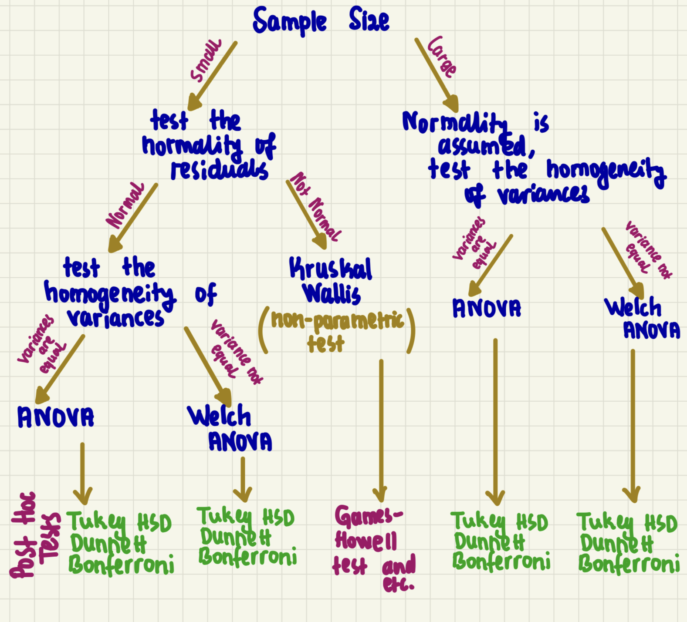

```{r setup, include=FALSE}
knitr::opts_chunk$set(echo = TRUE)
```


In a [previous post](https://muhammetozkaraca.com/blog/conducting-linear-regression-analysis-with-global-terrorism-database-gtd/), we have covered the main premises of conducting a multivariate linear regression test in R with the GTD along with its main diagnostics. For this tutorial, we will be focusing on how to conduct an Analysis of Variance (ANOVA) test in R. For this purpose, we will be using the same dataset, **full_data(1990-2020)**, we have used for the last tutorial. To recall what the dataset was about, it includes different World Bank Indicators alongside the number of terror events recorded in each country from the GTD data. While the dataset has a time range, having data between 1990 and 2020, the variables included in this dataset are as follows:

- **country_txt**: Country name
- **iyear**: Year^[Note that I have substituted one from the year columns across World Bank Indicators since, for example, the GDP per Capita for a given country in the year of 2020 is actually the GDP per Capita for the previous year.]
- **count**: Number of terror events in a given year for the associated country based on the GTD.
- **NY.GDP.PCAP.KD**: GDP per Capita (constant 2000 US$) for each country from 1970 to 2020
- **SE.ADT.LITR.ZS** : Literacy rate for each country from 1970 to 2020, representing the percentage of adults aged 15 and above.
- **SI.DST.10TH.10**: Income share (percentage) held by the highest 10% in each country from 1970 to 2020.
- **SI.POV.GINI**: Gini index indicating income inequality for each country from 1970 to 2020^[Note that the I took the Gini index along with the `SI.DST.10TH.10` variable just for fun. Essentially, these two variables will do the same thing of measuring the impact of economic inequality on the occurrence of terror events. Therefore, I will not include both of them in the same regression model, but as can be seen later on, they can be used as substitute for each other.]
- **MS.MIL.XPND.GD.ZS**: Military expenditure as a percentage of GDP for each country from 1970 to 2020. 

We will first go over the basics of the ANOVA, followed by a brief definition for its main assumptions. In 3^rd^ part, a real world data will be used to conduct the ANOVA test with the given information. 

::::: {.panelset}
::: {.panel}
[Loading Package&Data]{.panel-name}
```{r loading_packages_data, warning=FALSE, message=FALSE, echo=TRUE, class.source="codeBackground"}
options(scipen=999) # to prevent scientific notation 
library(tidyverse) # for data analysis purposes and visulization -> tidyverse mainly contains ggplot2 and dplyr


full_data_1990_2020 <- read_csv("full_data(1990-2020).csv")

full_data_1990_2020 <- full_data_1990_2020 %>%
  na.omit(SI.POV.GINI) %>%
  mutate(economic_inequality= case_when (SI.POV.GINI >= 45 ~ "High Inequality",
                                          SI.POV.GINI >= 30 & SI.POV.GINI < 45 ~ "Medium Inequality",
                                          SI.POV.GINI < 30 ~ "Low Inequality"))
```
:::
::: {.panel}
[full_data_1990_2020]{.panel-name}
```{r full_data_1990_2020, echo=FALSE, eval=TRUE, class.output="codeBackground"}
head(full_data_1990_2020)
```
:::
:::::


# A Gentle Introduction to ANOVA

Analysis of Variance (ANOVA) tests are used to determine whether there is a difference in the means of the groups at each level of the independent variable. In other words, ANOVA estimates how a quantitative dependent variable changes according to the levels of one or more categorical independent variables.^[As a rule of thumb, t-tests are employed for comparing two groups, whereas ANOVA is suitable for comparing three or more groups as in this case (High/Medium/Low income inequality.] To make it more concrete with the dataset we have, the **dependent variable** in our context is the `number of terror events occured across countries between 1990-2020` and the **independent variable** is `economic inequality`. Therefore we would like to see whether there is a statistically significant difference across countries having High/Medium/Low economic inequality in terms of the number of terror events they experienced. Accordingly, the hypothesis for our analysis will be;

- <u>Null Hypothesis</u>($H_{0}$): Countries, having high/medium/low economic inequality, <u>**are equal**</u> in terms of the number of terror events occurred. 
  - $\mu_{High Economic Ineqaulity}$ = $\mu_{Medium Economic Ineqaulity}$ = $\mu_{Low Economic Ineqaulity}$
- <u>Alternative Hypothesis</u>($H_{1}$): <u>**At least one type of country is statistically different from others**</u> in terms of the number of terror events occurred. 


# Main Premises of Analysis of Variance (ANOVA)

As in the case of multivariate regression tests covered in the [previous post](https://muhammetozkaraca.com/blog/conducting-linear-regression-analysis-with-global-terrorism-database-gtd/), ANOVA tests have also 4 main assumptions. They can be listed as;

1. <span style="color:red; font-weight: bold;">Variable Type</span>
2. <span style="color:red; font-weight: bold;">Independence</span>
3. <span style="color:red; font-weight: bold;">Normality</span>
4. <span style="color:red; font-weight: bold;">Equality of Variances (Homogeneity)</span>

## Variable Type

For ANOVA tests, it is necessary <u>to have a single continuous quantitative dependent variable (DV)</u> and <u>a qualitative independent variable (IV) with a minimum of two levels</u>. The IV will determine the groups that will be compared.

## Independence

ANOVA tests require that <u>the observations within each group are independent of each other</u>, and this condition can be verified based on the study design. However, a further test, **Durbin-Watson test**, can be used to assess whether this assumption is satisfied or not in case needed. 

## Normality

ANOVA tests requires the distribution of the residuals (the differences between the observed values and the predicted values) to be normal. In other words, the residuals should be normally distributed around zero and <u>*as a rule of thumb, for large sample sizes, normality is assumed to be satisfied*</u>. In this regard, there are three ways to check whether this assumption is met. 

<div class="sidenote">**If normality is not met, the non-parametric test, Kruskal Wallis, should be used instead of ANOVA** to see at least one group is statistically different from others.</div>

i) **Via visual depiction** -> using Histogram and/or Quantile-Quantile Plot (QQ Plot)
ii) **Via statistical testing** -> using shapiro.test
    - the Null Hypothesis ($H_{0}$) will be data come from normal distribution, while the alternative hypothesis
    ($H_{1}$) will be data do not come from normal distribution. 
    - In this scenario, having $p-value>0.05$ will demonstrate that there is not enough evidence to reject the Null
    Hypothesis ($H_{0}$) and therefore this criterion is met. 
iii) **Both**

## Equality of Variances (Homogeneity)

For this premise of the ANOVA test, the variances of the groups should be equal. 3 ways exist to check that assumption;

i) **Via visual depiction** -> using Histogram and/or Dot Plot and/or Scale-Location plot from `plot()` in R.
ii) **Via statistical testing** -> using Levene's test and others such as Barlett's test and etc.
    - the Null Hypothesis ($H_{0}$) is variances within groups are equal, while the alternative hypothesis
    ($H_{1}$) is variances within groups are not equal. 
    - In this scenario, having $p-value>0.05$ will demonstrate that there is not enough evidence to reject the Null
    Hypothesis ($H_{0}$) and therefore this criterion is met. 
iii) **Both**

<div class="sidenote">**If Equality of Variances is not met, Welch ANOVA test should be used**</div>

To sum up, the following figure might help which test to be used based on the specific features of the data. 

```{r summary_image, echo=FALSE, eval=TRUE, class.output="codeBackground"}

```

# Conducting ANOVA test in R

In this section, we will conduct an ANOVA test based on a real-world example. To that end, let's start running the ANOVA test first and then see whether it satisfies the main assumptions.  

::::: {.panelset}
::: {.panel}
[ANOVA Test]{.panel-name}
```{r running_anova_test, warning=FALSE, message=FALSE, echo=TRUE, class.source="codeBackground"}

anova_model <- aov(count~ economic_inequality, data = full_data_1990_2020)

```
:::
::: {.panel}
[Results]{.panel-name}
```{r running_anova_test_results, echo=FALSE, eval=TRUE, class.output="codeBackground"}

summary(anova_model)

```
:::
:::::

From the results, it can be seen that $p-value<0.05$, meaning that **<u>there is enough evidence to reject the Null Hypothesis ($H_{0}$) that there is no difference among groups (High/Medium/Low Economic Ineqaulity) with regards to the occurence of terror attacks</u>**. In other words, we can claim that *there is statistically significant evidence that at least one group has a difference in terms of the number of terror attacks they exposed to.*

Now, let's quickly go over the main assumptions and see whether the data we have to conduct the ANOVA meet them or not.

#### Variable Type

Variable type fits to the description mentioned above. Particularly, we do have a single continuous quantitative dependent variable (DV)</u> and <u>a qualitative independent variable (IV) with a minimum of two levels</u>

####  Independence

It can be claimed that the events are independent from the each other due to the study design we follow. One occurence is not influenced by another one.

####  Normality

As mentioned previously there are three ways to check normality of the ANOVA assumption. To recall them quickly, they are;

i) visually - Histogram & QQ Plot
ii) statistically - via Shapiro Test
iii) both

Now, let go over them in the following panel. 


::::: {.panelset}
::: {.panel}
[Histogram]{.panel-name}
```{r hist, warning=FALSE, message=FALSE, echo=TRUE, eval = TRUE, class.source="codeBackground"}

hist(full_data_1990_2020$count)

```
:::
::: {.panel}
[QQ Plot]{.panel-name}
```{r qq_plot, echo=TRUE, eval=TRUE, class.output="codeBackground"}

qqnorm(resid(anova_model))
qqline(resid(anova_model))

```
:::
::: {.panel}
[Shapiro Test]{.panel-name}
```{r shapiro_test, echo=TRUE, eval=TRUE, class.output="codeBackground"}

shapiro.test(full_data_1990_2020$count)

```
:::
:::::


From the initial two panels, *it is evident that our data does not exhibit a normal distribution*. Both the histogram and quantile-quantile (QQ) plot, which showcase the distribution of residuals, deviate from a normal distribution. This observation is further confirmed by conducting the Shapiro test in the third panel, yielding a result of $p-value<0.05$, meaning that <u>**there is enough evidence to reject the null hypothesis ($H_{0}$) that the data is normally distributed.</u>**

Although not meeting the normality assumption may introduce bias in the results, for the purpose of learning, we will proceed with examining the 4^th^ assumption of ANOVA, which is the Equality of Variances (Homogeneity).

####  Equality of Variances (Homogeneity)

According to this assumption, the variances of the groups in the ANOVA test are supposed to be equal. To test that, we again have three different options;

i) visually - via Histogram & Dot Plot
ii) statistically - via Levene's Test
iii) both


Now, as it has been done previously, let's go over with these 3 options in R. 

::::: {.panelset}
::: {.panel}
[Histogram]{.panel-name}
```{r hist_homogeneity, warning=FALSE, message=FALSE, echo=TRUE, eval = TRUE, class.source="codeBackground"}


full_data_1990_2020$economic_inequality <- factor(full_data_1990_2020$economic_inequality, 
                                                  levels = c("High Inequality", "Medium Inequality", "Low Inequality"))

ggplot(full_data_1990_2020, aes(x = count, fill = economic_inequality)) +
  geom_histogram(position = "identity", alpha = 0.6) +
  labs(x = "Value", y = "Frequency") +
  ggtitle("Histograms of Values by Inequality Status") +
  facet_wrap(~ economic_inequality, nrow = 1) +
  theme(legend.position = "none")


```
:::
::: {.panel}
[Dot Plot]{.panel-name}
```{r dotplot, echo=TRUE, eval=TRUE, class.output="codeBackground"}

ggplot(full_data_1990_2020, aes(x = economic_inequality, y = count)) +
  geom_point()
  
```
:::
::: {.panel}
[Levene's Test]{.panel-name}
```{r levene_test, echo=TRUE, eval=TRUE, warning = FALSE, message = FALSE, class.output="codeBackground"}
library(car)

leveneTest(count ~ economic_inequality, data = full_data_1990_2020)


```
:::
:::::

Beginning with the histogram, it is evident that the variances within each group are high due to the right-skewed distribution of the number of terror events. Upon examining the dot plot, it becomes apparent that the variances within each group also exhibit a considerable variation. To statistically test this using Levene's test in the third panel, the resulting $p-value$  is found to be lower than 0.05, indicating  <u>**sufficient evidence to reject the null hypothesis ($H_{0}$) that the variances are equal across groups.</u>** 

To wrap up, in this tutorial, we covered the basics of Analysis of Variance (ANOVA) test in R along with mentioning its main assumptions. I hope that this was helpful and for further reference, you can refer to the following tutorials, which provide detailed explanations of the concepts discussed in this blog post:

- [ANOVA in R](https://statsandr.com/blog/anova-in-r/)
- [ANOVA](https://www.statmethods.net/stats/anova.html)


